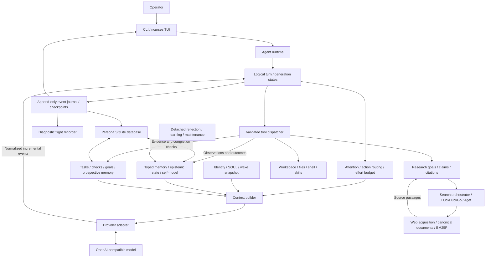

# Saga

**The model thinks. The runtime remembers. The agent persists.**

Saga is a C++23 CLI/TUI runtime for persistent personal agents. Each persona owns
an identity, autobiographical memory, knowledge, procedures, goals and unfinished
work. This state survives sessions and model changes.

`saga` is the ncurses client; `sagad` owns cognition, tools and persistence. The
client starts the daemon automatically and communicates over a private Unix
socket. Models run through an OpenAI-compatible HTTP endpoint, including llama.cpp.

```sh
cmake -S . -B build -DCMAKE_BUILD_TYPE=Release
cmake --build build -j
ctest --test-dir build --output-on-failure
./build/saga
```

Requires Linux, a C++23 compiler, CMake, SQLite with FTS5/JSON, libcurl 7.85+ with
asynchronous DNS, wide ncurses and MD4C. Lexbor and the nlohmann JSON header are
vendored. No Python, Node, browser or external extraction service is required at
runtime. `cmake --install build --prefix PREFIX` installs both executables.

On first use, select or create a persona, then configure an endpoint and optional
API key. Saga discovers models and serving context metadata; unknown context
requires a manual value. The default minimum is 65,536 tokens, with an explicit
advanced override for smaller contexts. `SAGA_API_KEY` overrides the configured
key; an empty key sends no Authorization header.

# Architecture

The model proposes language and actions. The runtime retrieves context, enforces
permissions and evidence requirements, executes tools and records outcomes.
Persona selection belongs to the control plane; cognitive tools receive only
the active persona.



Search discovers URLs; acquisition also accepts direct URLs and stored snapshots.
Runtime activity and diagnostic events stay separate from conversation history.
Only selected messages, cognitive state and tool observations enter model context.

## Cognitive capabilities

| Capability | Persistent representation and agent integration |
| --- | --- |
| Identity and continuity | `SOUL.md` seeds behavior; wake restores recent life, project state, unfinished tasks, commitments and open loops. The session's identity and wake prefix stay stable across generations and compaction. SOUL changes require deliberate operator action. |
| Autobiographical memory | Episodes, diaries, sessions and immutable life events preserve experience. `remember` retrieves bounded previews; deep retrieval expands the search. `recall_memory`, `recall_session`, `recall_event` and `recall_observation` recover original records using distinct typed IDs. |
| Semantic knowledge | `know` retrieves facts and beliefs. `learn_fact` records provenance and global/project scope; corrections close the old validity interval and retain its history. Beliefs remain separate from facts. |
| Retrieval and attention | FTS5 BM25 combines lexical, entity, project, goal, salience, recency, confidence and accessibility signals. Automatic queries preserve technical terms and stay bounded. Context selection uses token budgets, current objectives and evidence relevance. |
| Working memory | Persisted attention, a work ledger, operator constraints, required checks, artifact hashes and research coverage guide each generation. Large observations receive query-focused excerpts; full results remain archived. |
| Planning and completion | `task_create`, `task_update` and `task_add_check` track objectives, explicit risk and definitions of done. `check_resolve` distinguishes execution, content, research and operator confirmation. Changed dependencies invalidate stale proof. High-risk or calibration-flagged work receives a fresh-context review. |
| Epistemic reasoning | Assumptions and hypotheses retain unresolved/confirmed/rejected state. Predictions precede observations. `record_evidence` attaches support or contradiction with source provenance; reasoning confidence and evidence confidence remain separate. |
| Research | `research_plan` separates intent, constraints and desired actions from external knowledge requirements. Goals contain concrete claims; `research_status` exposes coverage and gaps. Resolution requires fetched passages and an explicit assessment; revisions preserve the original claim. Search snippets cannot establish claims. |
| Goals and prospective memory | Session, project, long-term and self-improvement goals coexist with commitments, open loops, WHEN/THEN intentions and curiosities. Completion/closure tools retain outcomes; maintenance queues restrained reminders rather than autonomous external actions. |
| Decisions and perception | Project decisions retain rationale. `observe_environment` inspects the clock, machine, git state and workspace. File tools and shell observations track artifacts, versions, hashes and removals for later recall and verification. |
| Procedural learning | `know_how` retrieves praxis and failed strategies. Procedures begin as candidates; task evidence and Beta success/failure accounting govern learned, validated and habitual promotion. `compile_skill` turns habitual praxis into a macro; every `run_skill` action still passes normal gates. |
| Adaptation and self-model | Explicit preferences, repeated relationship patterns and developed traits retain supporting events. Prediction/observation history informs domain calibration and review. Internal confidence, curiosity, frustration and drives are runtime indicators, not independent proof of competence. |
| Reflection and consolidation | Session closure writes a provisional diary locally. Detached maintenance refines it and extracts supported facts/procedural candidates from bounded event batches, advancing a successful watermark. Immutable sources survive extraction and forgetting. |
| Compaction and recovery | Local transactional checkpoints preserve objectives, decisions, evidence references, unresolved work and typed record references. Older exchanges leave the prompt without being deleted. Wake recovers interrupted sessions; completed tools are not automatically replayed. |
| Communication and effort | `report_progress` publishes operational commentary. Private reasoning, public text and tool activity are distinct channels. Repeated unchanged observations trigger a strategy warning; search, read, generation and continuation budgets bound work. |

Cognitive actions are demand-driven. Conversation turns expose a small seven-tool
set; work turns expose 29 common tools. `tool_schema` and `tool_invoke` make the
remaining registry available through the same validated dispatcher. Heuristic
routing guides attention; permissions, provenance and completion gates remain
runtime decisions.

Praxis becomes learned after two successes, validated after five uses with four
successes, and habitual after ten uses with a strong record. Calibration uses
agent-recorded outcome assessments; it is a review signal with source provenance.

## Generation and action lifecycle

One user message owns one logical turn, which may contain many model generations
and tool executions. Changing workspace does not redispatch that message. Tool
call IDs support replay of committed results rather than repeated execution.

The provider adapter consumes SSE incrementally and normalizes reasoning, public
text, commentary, fragmented tool calls, usage and finish reasons. The runtime
updates turn state while the TUI observes coalesced events. Private reasoning
stays hidden; thinking, prompt preparation, tool execution and approvals remain
visible. Completed tool results are persisted before the dependent generation.

`finish_reason=length` produces an incomplete generation and a bounded continuation
in the same turn, preserving its state. Transient transport failures use a
separate retry policy. Reasoning-only output is not an empty response. Output
allowances respect remaining context, model metadata and configured hard limits;
8,192 is the compatible initial reserve, not a universal ceiling.

Files use hash-checked edits and approval diffs. Execution checks require current,
successful shell evidence; file content requires an exact quoted read; research
requires documentation; confirmation requires an operator acknowledgement.
Declared execution inputs or a bounded workspace fingerprint track dependencies.
These gates establish provenance and freshness; they do not prove arbitrary
program semantics. See [generation and context lifecycle](docs/generation-runtime.md).

## Search and document acquisition

`WebResearch` uses `SearchOrchestrator` and interchangeable `SearchEngine` adapters.
DuckDuckGo is first by default, with a shared minimum one-second request interval
and challenge cooldown. 4get discovers cached public instances, lazily probes
`/ami4get`, excludes incompatible API/bot-protected instances, ranks health and
observed latency, and performs bounded failover with instance cooldowns. Pagination
retains instance affinity. Engine order is configurable; CAPTCHA is respected.

Repeated successful searches and same-turn URL reads reuse observations within
bounded budgets. A failed engine does not invalidate acquired evidence or fail
the whole investigation. Coverage tracks each claim independently; provenance is
validated by code, while semantic entailment remains the model's assessment.

Acquisition runs entirely inside Saga:

```text
HTTP → inspection / platform detection → API, Markdown, plain text or Lexbor HTML
     → CanonicalDocument → sanitization / normalization / deduplication
     → query-aware BM25F section selection → compact Markdown with provenance
```

GitHub/GitHub Enterprise, GitLab, Forgejo/Gitea, Discourse and MediaWiki handlers
prefer structured public APIs, with textual fallback. Self-hosted detection
supports mount paths. Generic extraction uses prose, documentation, discussion,
reference and listing profiles, scored regions and strict/balanced/recall passes.
Code, diffs, useful warnings and bounded tables retain structure. HTTP validators,
instance detection, canonical documents and template observations are cached.

Raw HTML and API JSON never enter cognition. No extraction LLM, embeddings,
JavaScript runtime or browser is used. TLS, connected-address SSRF checks, safe
redirects, timeouts and response/DOM limits guard acquisition. Defaults include
2 MiB responses, 256 KiB documents and five redirects. PDFs, authenticated sites
and JavaScript-only pages are unsupported. See [search policies and configuration](docs/search.md).

## Persistence and isolation

| Location | Contents |
| --- | --- |
| `$XDG_CONFIG_HOME/saga/config.toml` | Global model/runtime configuration |
| `$XDG_DATA_HOME/saga/registry.db` | Persona selection metadata |
| `$XDG_DATA_HOME/saga/personas/<uuid>/` | `SOUL.md`, `agent.db`, private artifacts and caches |
| `$XDG_STATE_HOME/saga/logs/` | Diagnostic recordings |
| `$XDG_RUNTIME_DIR/saga/` | Private socket and control token |

Unset XDG variables use standard home fallbacks; an unavailable runtime directory
uses `/tmp/saga-<uid>/saga/`. Private directories use 0700 and sensitive files
0600. Each persona has an exclusive context lock and its own SQLite database,
with WAL, foreign keys, migrations and immutable source events. Workspace files
are separate from persona storage.

Sandbox shell commands are automatic, project/scratch scoped and network-disabled.
`/permissions 1` asks before guarded host operations, structured edits and workspace
changes; `2` approves them automatically. `3` asks before unrestricted host
operations; `4` approves them automatically. Unrestricted host execution runs as
the daemon's OS user and can access that user's private files. It grants no root
privileges. Public read-only web access has its own `/web on|off` control.

`/erase NAME_OR_UUID` permanently deletes that persona's memories, sources,
conversations, SOUL, tasks, private artifacts, caches and owned diagnostic bundles.
Erasing the active persona returns to selection. Other personas, configuration and
project files remain. External backups, exports and unregistered old custom log
locations cannot be erased automatically; filesystem deletion is not secure erasure.

## Operator interface and diagnostics

| Commands | Purpose |
| --- | --- |
| `/help`, `/status`, `/permissions`, `/web` | Usage, current state and access policy |
| `/new`, `/persona`, `/model`, `/erase NAME_OR_UUID` | Session, identity and backend lifecycle |
| `/name`, `/soul` | Inspect or deliberately edit identity |
| `/memory`, `/know`, `/praxis`, `/artifacts`, `/journal` | Inspect persistent knowledge and experience |
| `/goals`, `/tasks`, `/self`, `/project`, `/state` | Inspect cognition and workspace continuity |
| `/fact JSON`, `/correct JSON` | Explicit knowledge and corrections |
| `/compact`, `/steer PROMPT`, `/stop`, `/exit` | Context handoff, steering, cancellation and shutdown |

The TUI renders Markdown, streamed public output, tool activity and reviewable
diffs. Page Up/Down and the wheel scroll; F2 enables terminal selection/copy.
Inspection commands remain available during work. Ctrl+C, Escape or `/stop`
cancel active inference/tools and queued steering while preserving completed
changes. `--no-tui` selects line chat; `--batch UUID --json` supports scripts.

`saga --debug debug|trace|wire|forensic` enables the JSONL flight recorder. Profiles
progress from lifecycle/decisions to detailed context/cognition, HTTP/SSE and
forensic snapshots. Logs correlate session, turn, generation and tool IDs with
sequence numbers and wall/monotonic timestamps; large payloads use sidecars.
Redaction remains enabled in forensic mode. `--debug-allow-secrets` explicitly
disables it. Recordings can contain private conversation and persona content.

Files use `<persona>-<session>-<unix-seconds>.log`; the printed `follow` path tracks
persona/session changes and rotation. The recorder includes context accounting,
memory writes, search decisions, filesystem observations and a bounded crash
buffer. See [diagnostic profiles, redaction and crash guarantees](docs/diagnostics.md).

Tests use synthetic fixtures and mocked providers/search engines. Run sanitizer
checks with `-DSAGA_SANITIZERS=ON` in a separate Debug build; compiler ASan/UBSan
libraries are required. Tests needing local sockets report a skip when the host
denies them. `python3 tests/pty_chat.py` is an optional development-only TUI check.

Only source, build definitions, documentation and synthetic fixtures belong in
this repository. Never commit persona data, credentials, databases, conversations,
logs or generated artifacts. `src/schema.sql` is the application schema.

Project license: [LICENSE](LICENSE). Vendored dependencies retain their own licenses.
